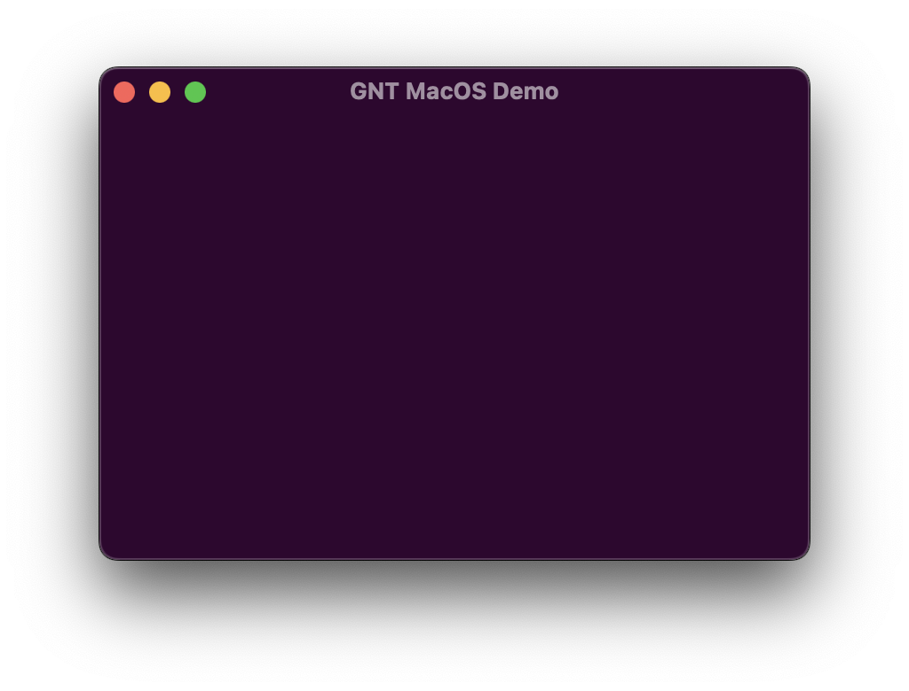

# gtk-native-tweaks

Batch of tweaks to give more control over GTK4 applications


**Note:** At the moment only macOS is supported.

## Some features

- change the titlebar color
- change the window position
- activate/deactivate titlebar buttons

## Setup & build

**Requirements:**

- C++14 and C11 compilers
- meson
- gtk4
- git

**Build:**
clone and cd into the directory

```bash
meson setup build
cd build
meson compile
```

#### Test

**Make tests interactive:**

```bash
cd ..
meson configure build -Dinteractive_test=true
```

**Run**

```bash
meson test --verbose
```

## Install

```bash
meson install
```

## Uninstall

```bash
ninja uninstall
```

## Usage

#### Meson

```meson
gnt_dep = dependency('gnt-0.1')
e = executable(
...
dependencies: [gnt_dep],
...
)
```

#### Cmake

```cmake
find_package(PkgConfig REQUIRED)
pkg_search_module(gnt REQUIRED IMPORTED_TARGET gnt-0.1>=0.1)

target_link_libraries(... PkgConfig::gnt)
```

#### C/C++

```c
#include <gnt/gnt.h>
...
gtk_window_present(window) // window must be presented before, but it's fast so it's not a problem
GntMacosWindow *gnt_macos_window_new(window);
// here all the tweaks
```

**Note:** There are functions independent to the `GntMacosWindow` object, you can use them without creating an object.

#### Python

Python bindings are available and installed by default, there is an example in the `examples` directory.

**Note:** At the moment there is no stubs generated, but the api is almost the same as the C api (just look at the header file).
